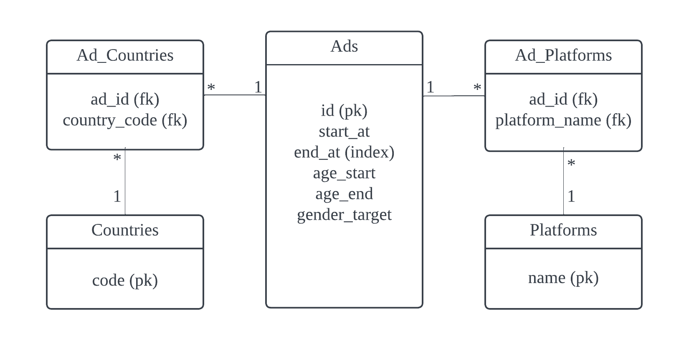
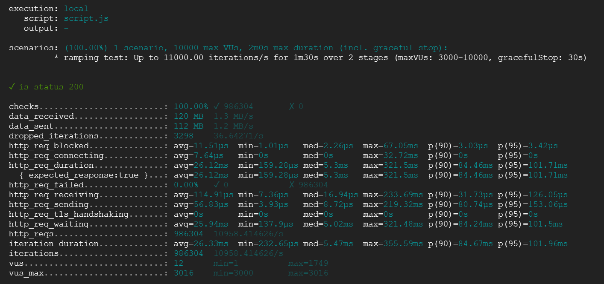

# Advertisement Service

## Project Overview

A backend service for managing advertisements with high performance and scalability.

To try it online, make API requests to  [https://dcard-backend-33cjpqddvq-de.a.run.app/api/v1/ad](https://dcard-backend-33cjpqddvq-de.a.run.app/api/v1/ad).

To try it locally, clone the repository and run the following commands:

```bash
docker-compose up -d
```

Then make API requests to [http://localhost:8080](http://localhost:8080).

## Technologies Used

- **Programming Language**: GO 1.22
- **Framework**: Fiber
- **Database**: PostgreSQL 13, Redis 6
- **Containerization**: Docker, Docker Compose
- **Cloud Provider**: Google Cloud Platform (GCP)
- **CI/CD**: GitHub Actions

## API Documentation

For more detailed information on the API endpoints and their usage, please refer to our [API documentation](API.md).

## Handler Design

### Create Ad

1. Validate request payload
2. Parse request into database format
3. Insert into database

### List Ads

1. Parse query parameters
2. Validate query parameters
3. Query redis for ads with key equal to query parameters. If ads not found, jump to step 6.
4. If ads not found, query database and save results ads to redis.
5. Return ads

## Redis Design

- TTL for redis key is 1 minute.
- On insert, increment cache version.
- On query, reorder the query parameters, combining with cache version, and serve as the key for searching in redis.
- Check if the ads are valid (end_time > now), remove and clear the cache if any invalid ads found.

## Database Design



### Explanation

1. Since the return should be sorted by end_at, create index on end_at.
2. For gender, since there are only two possible values and is not expected to change, create it directly in the ads table, null denotes both genders.
3. For countries and platforms, create a separate table with a many-to-many relationship with ads for better extensibility.

## Testing

### Unit Testing

Unit tests are written using the Go testing framework.

To run the tests, navigate to the src directory and run the following command:
```
go test -v ./...
```

The tests include unit tests for the validation checks and the api handlers.

### Load Testing

Load tests are written using the K6 load testing framework.

To run the load tests, navigate to the tests/load directory and run the following command:
```
k6 run script.js
```

The load tests simulate a high volume of requests and measure the response time and throughput of the API.

## CI / CD

We use GitHub Actions for CI/CD. The workflow file is located in the .github/workflows directory.

### CI

The CI workflow is triggered on push/pr events to the main branch.

It runs the unit tests and the load tests to ensure the code is working as expected.

### CD

The CD workflow is triggered on only push events to the main branch.

It builds the Docker image, pushes it to the GCP container registry, and deploys it to the GCP cloud run service.

## Performance

### Local

It reached 10000+ RPS in local environment according to the load test.



### Remote

It reached 1500 RPS in remote environment without using Redis. I can't conduct load test with Redis because of the free tier limit.

## Changelog

| Time       | Content |
|------------|---------|
| 4/4 21:00     | Started the project and created the basic structure of the API.  |
| 4/6 00:00     | Completed the basic requirement except for the RPS limit. RPS=500  |
| 4/6 22:00     | Completed CI/CD to auto build and deploy the project to GCP  |
| 4/6 23:00     | Migrate the database to GCP, RPS=2000  |
| 4/7 02:00     | Add Redis to the project  |
| 4/7 02:45     | Use docker-compose to run and test the project locally, RPS=10000+  |

## Further Improvements

- Deploy the project with kubernetes and use a load balancer to distribute the traffic.
- Optimize the cache system.